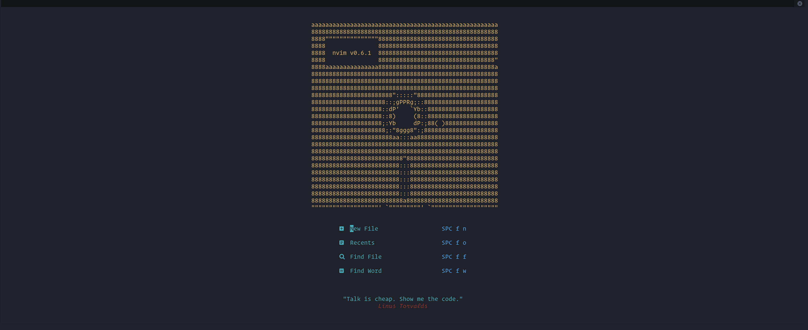
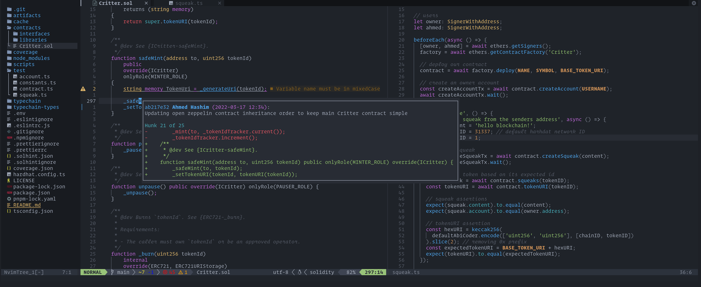
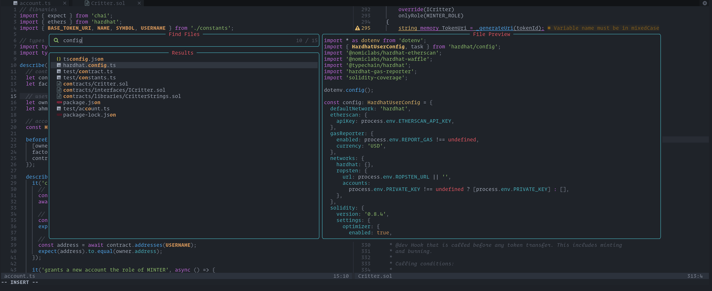

  <h1>neovim-config</h1>

  <h6>A modern config for <a href="https://neovim.io">neovim</a> focused on developer experience.</h6>

Including:

- Language server support
- Syntax highlighting
- Code actions
- Terminal support
- Full Git integration
- Fuzzy finder

...and [a few other things.](https://github.com/ahashim/neovim-config/blob/main/lua/plugins.lua)

## Requirements

- [neovim](https://neovim.io) version 0.6.0 or above.
- `:checkhealth` returns all `OK` status in green.

## File Structure

    nvim
    ├── init.lua                    # initialization
    └── lua/                        # neovim config files
        ├── autocommands.lua
        ├── core.lua
        ├── mappings.lua
        ├── plugins.lua
        ├── theme.lua
        └── settings/               # plugin settings
            ├── bufdelete.lua
            ├── bufferline.lua
            ├── colorizer.lua
            ├── comment.lua
            ├── dashboard.lua
            ├── devicons.lua
            ├── fugitive.lua
            ├── gitsigns.lua
            ├── indent-blankline.lua
            ├── lspconfig.lua
            ├── lspkind_icons.lua
            ├── lspkind_saga.lua
            ├── luasnip.lua
            ├── markdown-prview.lua
            ├── null-ls.lua
            ├── nvim-cmp.lua
            ├── nvimtree.lua
            ├── onedark.lua
            ├── statusline.lua
            ├── telescope.lua
            ├── treesitter.lua
            └── trouble.lua

## Mappings

Commonly used mappings in this config. [View the full list here](https://github.com/ahashim/neovim-config/blob/main/lua/mappings.lua#L27).

| Shortcut               | Mode     | Description                                                               |
| ---------------------- | -------- | ------------------------------------------------------------------------- |
| <kbd>Space db</kbd>    | Normal   | Dashboard                                                                 |
| <kbd>Space fn</kbd>    | Normal   | New File                                                                  |
| <kbd>Space w</kbd>     | Normal   | Save                                                                      |
| <kbd>Space q</kbd>     | Normal   | Quit                                                                      |
| <kbd>Shift + t</kbd>   | Normal   | New Buffer                                                                |
| <kbd>Tab</kbd>         | Normal   | Next Buffer                                                               |
| <kbd>Shift + Tab</kbd> | Normal   | Previous Buffer                                                           |
| <kbd>Ctrl + t</kbd>    | Normal   | New Tab                                                                   |
| <kbd>Ctrl + n</kbd>    | Normal   | Toggle directory tree view                                                |
| <kbd>Space e</kbd>     | Normal   | View current file in directory tree view                                  |
| <kbd>Ctrl + a</kbd>    | Normal   | Copy entire file content                                                  |
| <kbd>Esc</kbd>         | Normal   | Clear search highlight                                                    |
| <kbd>Space /</kbd>     | Normal   | Toggle comment                                                            |
| <kbd>Space h</kbd>     | Normal   | New horizontal terminal                                                   |
| <kbd>Space v</kbd>     | Normal   | New vertical terminal                                                     |
| <kbd>jk</kbd>          | Terminal | Exit terminal mode                                                        |
| <kbd>'</kbd>           | Visual   | Convert double-quotes to single quotes within range                       |
| <kbd>Space hb</kbd>    | Normal   | Git blame current line                                                    |
| <kbd>Space df</kbd>    | Normal   | Git diff                                                                  |
| <kbd>Space dc</kbd>    | Normal   | Git diff --cached                                                         |
| <kbd>Space cm</kbd>    | Normal   | Git commit                                                                |
| <kbd>Space ps</kbd>    | Normal   | Git push origin                                                           |
| <kbd>Space \[c</kbd>   | Normal   | Go to next changed hunk                                                   |
| <kbd>Space ha</kbd>    | Normal   | Stage the current hunk                                                    |
| <kbd>Space hu</kbd>    | Normal   | Undo staging hunk                                                         |
| <kbd>Space hp</kbd>    | Normal   | Preview hunk                                                              |
| <kbd>Space hd</kbd>    | Normal   | Diff current file                                                         |
| <kbd>Space tb</kbd>    | Normal   | Toggle current line blame                                                 |
| <kbd>Space td</kbd>    | Normal   | Toggle deleted                                                            |
| <kbd>gh</kbd>          | Normal   | Find all instances of the symbol under the cursor                         |
| <kbd>gd</kbd>          | Normal   | Preview symbol definition                                                 |
| <kbd>gr</kbd>          | Normal   | Rename all instances of the symbol                                        |
| <kbd>gs</kbd>          | Normal   | Signature help                                                            |
| <kbd>gx</kbd>          | Normal   | Code actions                                                              |
| <kbd>K</kbd>           | Normal   | Hover documentation                                                       |
| <kbd>go</kbd>          | Ex       | Show line diagnostics                                                     |
| <kbd>gj</kbd>          | Normal   | Diagnostics jump next                                                     |
| <kbd>gk</kbd>          | Normal   | Diagnostics jump previous                                                 |
| <kbd>Space xx</kbd>    | Normal   | Toggle Trouble diagnostics                                                |
| <kbd>Space xw</kbd>    | Normal   | Trouble workspace diagnostics                                             |
| <kbd>Space xd</kbd>    | Normal   | Trouble document diagnostics                                              |
| <kbd>Space xl</kbd>    | Normal   | Trouble loclist                                                           |
| <kbd>Space xq</kbd>    | Normal   | Trouble quickfix                                                          |
| <kbd>Space fb</kbd>    | Normal   | Telescope find in all buffers                                             |
| <kbd>Space fa</kbd>    | Normal   | Telescope find in all files                                               |
| <kbd>Space ff</kbd>    | Normal   | Telescope find in all files (exluding hidden files & those in .gitignore) |
| <kbd>Space lg</kbd>    | Normal   | Telescope view git commits                                                |
| <kbd>Space gt</kbd>    | Normal   | Telescope view git status                                                 |

## Roadmap

- Figure out terminal autocomplete colors & how to darken the buffer with `winhighlight`.
